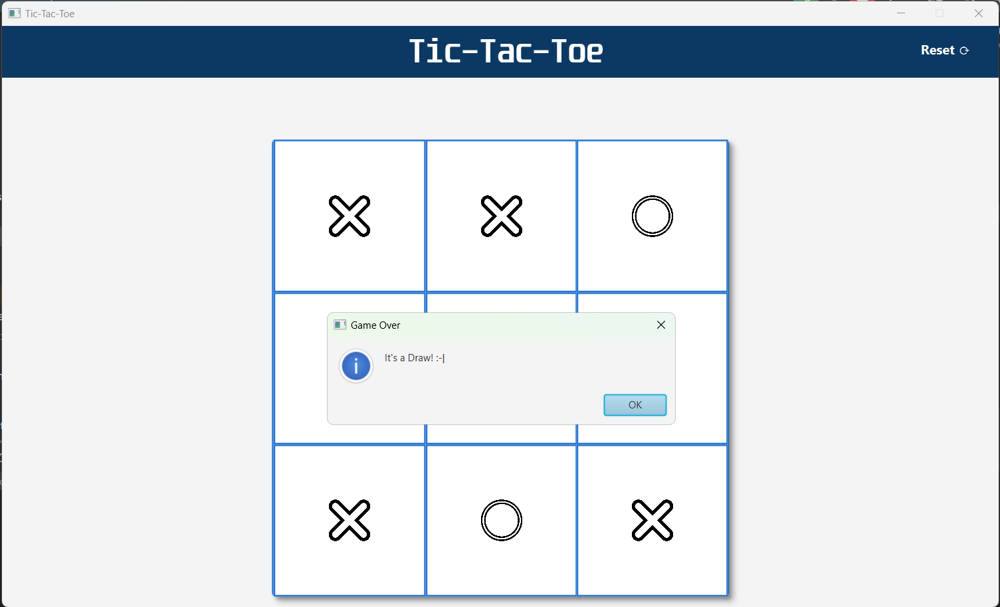

# JavaFX Tic-Tac-Toe Game

A simple and interactive Tic-Tac-Toe game built using JavaFX. The game features a human player vs AI mode, with support for selecting either X or O, detecting wins and draws, and resetting the game after each round. The game also provides alerts for game outcomes, such as when a player wins or when there is a draw.

## Features
- Player vs AI gameplay
- Choose between X or O
- Detects win conditions and displays a congratulatory message
- Handles draw scenarios and resets the game automatically
- Clean and responsive UI built using JavaFX

## File Structure

## How to Run

1. Clone the repository:
   ```bash
   git clone https://github.com/yourusername/tic-tac-toe-javafx.git
   
2. Open the project in your preferred Java IDE (e.g., IntelliJ IDEA, Eclipse).

3. Ensure JavaFX is properly set up in your environment.

4. Run the AppInitializer.java class to launch the game.

## Screenshots

### 1. Welcome Page & Player Selection


### 2. Play workplace


### 3. Player Wins


### 4. AI Wins


### 5. Game Draw


